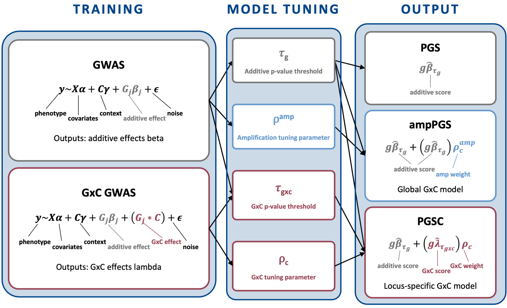

# PGSC pipeline

SLURM/PLINK2 pipeline for context-specific polygenic scoring (PGSC) in UK Biobank: additive and GxC interaction GWAS, PGS scoring, and bootstrapped R² evaluation across ancestries.

📄 **Manuscript:** [Locus-specific gene-context interactions improve polygenic prediction](https://doi.org/10.64898/2026.08.26.746823) 

The companion [PGSC figures repo](https://github.com/reneemf/PGSC_figures) reproduces the manuscript figures and contains the simulations.

Three methods are built: **PGS** (additive baseline), **ampPGS** (genome-wide amplification), and **PGSC** (locus-specific GxC), across three contexts (sex, age, statins) and four populations (White British train/test + European, African, Asian validation).



## Requirements

- **PLINK2** v2.0 — genotype processing, GWAS, scoring
- **R ≥ 4.3** with `dplyr`, `ggplot2`

## Input data

Data requirements: per-chromosome UKB genotypes, one phenotype file per trait, a 10 PCs + sex/age covariate file, and context files as needed (pipeline constructed for use in a slurm system - UKB has since transitioned to the RAP cloud system). Expected file names and columns are documented in the header comments of each script. 

## Setup

Every script sources `source_file.sh` or `source_file.R` - edit the paths at the top of each file, and the `#SBATCH -o/-e` log paths in each script.

## Run

```bash
# 1. Prepare genotypes  (expects per-chromosome PGEN input)
sbatch data_prep/make_bed_QC.sh      # subset pops + QC → BED (chr array)
sbatch data_prep/join_bed_chrs.sh    # merge chromosomes
sbatch data_prep/90_10_split.sh      # 90/10 train/test split

# 2. GWAS
bash   gwas_scripts/run_gwas.sh       # build covariates; submit additive + GxC GWAS (per chr)
sbatch gwas_scripts/join_gwas.sh      # concatenate per-chromosome outputs

# 3. Score on test set + tune thresholds
bash   pgs_scripts/run_PGSC.sh                  # edit to enable test_PGS_PGSC.sh or just run sbatch test_PGS_PGSC.sh
sbatch analysis_scripts/pgs/build_R2s.sh        # edit to enable compile_test_pgs.R & pick best threshold per model

# 4. Score on validation pops + evaluate
bash   pgs_scripts/run_PGSC.sh                  # edit to enable validate_PGS_PGSC.sh or just run sbatch validate_PGS_PGSC.sh
sbatch analysis_scripts/pgs/build_R2s.sh        # edit to enable compile_valid_pgs.R: bootstrapped R² / ΔR²
```

GxC-significant locus counts can be run independently: `sbatch analysis_scripts/sig_loci_count.sh`.

`analysis_scripts/pgs/calculate_R2.R` is the script used to replicate the results in the BioMe/MSM cohort.

## Output

Written under `pgsc_output/`: `joined_gwas/` and `joined_gxewas/` (additive + GxC GWAS), `pgs_out/` and `pgs_gxe_out/` (`.sscore` files), `r2_out/` (R² summaries), `sig_loci/`, `pop_counts/`.

## License

MIT — see [LICENSE](LICENSE). Renée Fonseca, University of Chicago, Dahl Lab.
